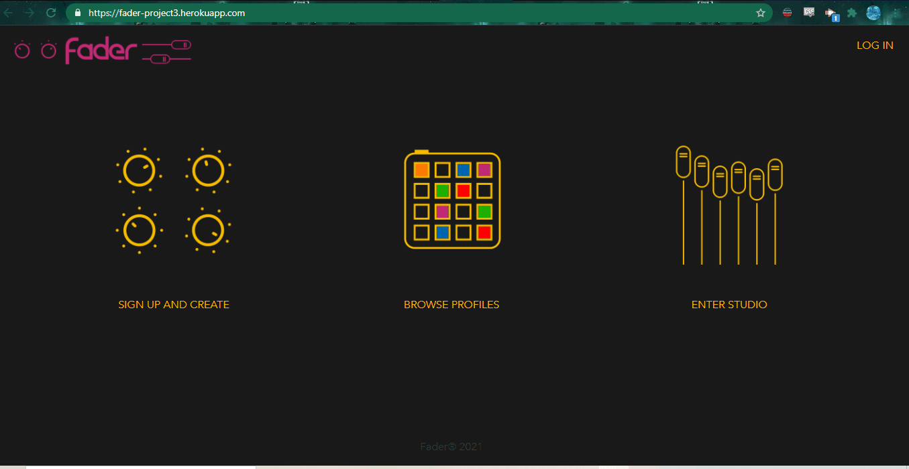
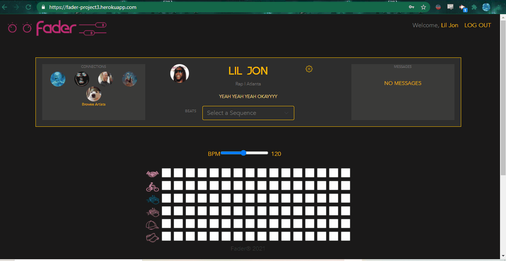

# FADER

A social media studio for artists.

### Links

* Heroku Deployed: [https://fader-project3.herokuapp.com/](https://fader-project3.herokuapp.com/)

* Github Repo: [https://github.com/ElderBass/Fader.git](https://github.com/ElderBass/Fader.git)

## Table of Contents

* Description(#description)

* Demonstration(#demonstration)

* Technologies(#technologies)

* Contributing(#contributing)

* Questions(#questions)

## Description

Fader is a React, node.js app geared toward artists but catering towards everyone. It's a social media app at route that allows signed up users to create their own beats with our sequencer. If one is not signed up, you can only view other people's profiles, the mixes they've created, and experiment with the sequencer in our studio, but one can't actually save their creations before signing up.

If one signs up, the sky's the limit. They can follow other artists, leave messages on other artists' profiles, create and save mixes, remix other artists' mixes, and more. 

On launch, the user hits our landing page. They have three options - sign up, browse artist profiles, or enter the studio and start experimenting with the sequencer.

The sequencer itself is a functional React component that utilizes hooks and state to work. Users can add beats and have them render dynamically as the sequencer loops. The user can also adjust the BPMs for the sequencer they are creating by adjusting the slider. 

Overall, the site is geared towards the musically inclined - or anyone with a penchant for hard beats. Experienced or inexperienced, novice or professional, everyone can have fun toying with our sequencer and checking out what other artists have created.

## Demonstration

* Signup/Login Feature:

* User Functionality:

## Technologies

* Javascript, React - programming logic and HTML
* Express - backend routing
* Bootstrap and React-Bootstrap npm - framework for styling
* MongoDB/Atlas, mongoose - database for storing user information
* Heroku - hosting our application
* JWT, bcryptjs - user authentication
* Midi-sounds-react npm - sequencer component

## Contributing

### The Fader Crew:

* Carson Scholberg and Dory Kahale:
    * CSS styling, component and site layouts, React UI/UX
* Jack Battle and Will Heyer:
    * Sequencer integration and functionality
* Seth Zygarlicke
    * Backend routing, global/local state in react, database integration

If you wish to contribute to the repo, please email Seth Zygarlicke at [zygster11@gmail.com](zygster11@gmail.com)

## Questions

For anyone questions concering the project, feel free to reach out to any of the members - Dory Kahale, Will Heyer, Carson Scholberg, Jack Battle, or email Seth Zygarlicke at [zygster11@gmail.com](zygster11@gmail.com)

